# recruitment-site

## 환경변수

'.env.example' 파일의 이름을 '.env' 로 변경하고 아래 내용을 채움

```sh
DATABASE_URL=mysql://계정이름:비밀번호@주소:포트/DB명
SERVER_PORT=서버 포트
ACCESS_TOKEN_SECRET=JWT 생성을 위한 비밀키
REFRESH_TOKEN_SECRET=JWT 생성을 위한 비밀키
```

## 프로젝트 목표

1. Express.js, MySQL을 활용해 나만의 채용 서비스 백엔드 서버 만들기

2. 코드 Layer를 분리하여 유지보수성 및 코드 재사용성 향상 시키기

3. Unit test 코드를 작성하여 유지보수성 향상

## 프로젝트 내용

1. 회원 가입 기능을 통해 유저를 생성할 수 있다.
   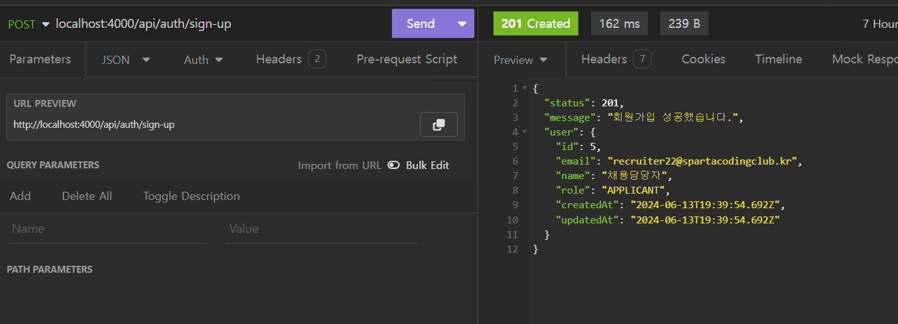

2. 로그인 시 Access Token, Refresh Token을 발급하여 사용자 인증이 가능하다.
   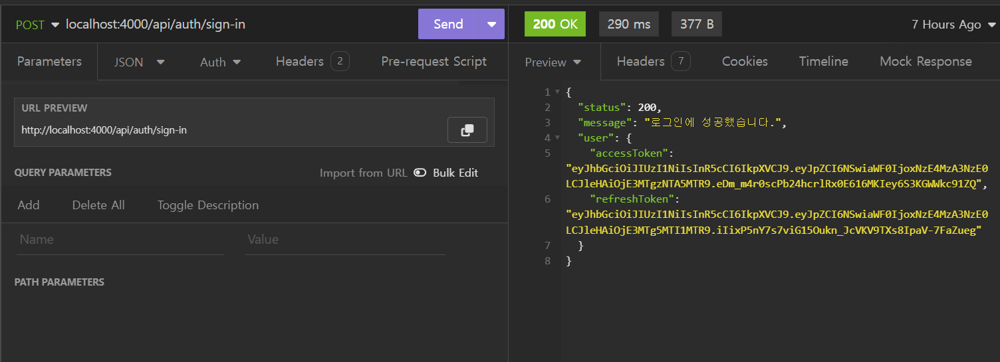

3. Refresh Token을 이용하여 로그아웃, 토큰 재발급을 할 수 있다.

- 로그아웃
  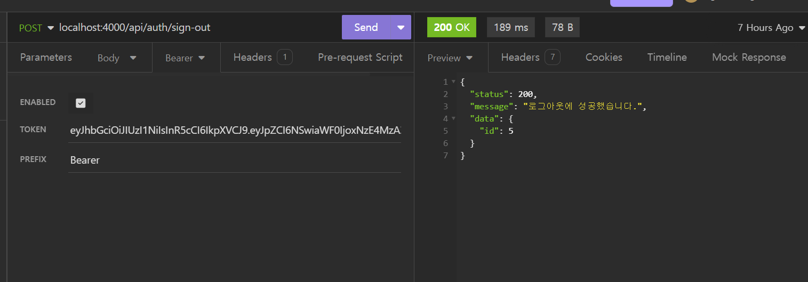

- 토큰 재발급
  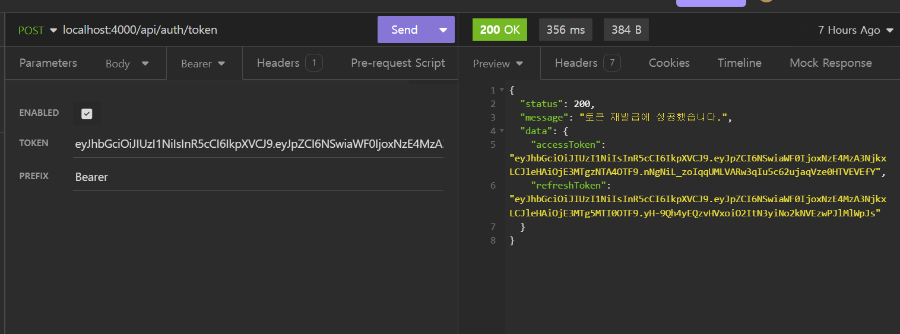

4. Access Token을 이용하여 사용자 정보를 조회할 수 있다.
   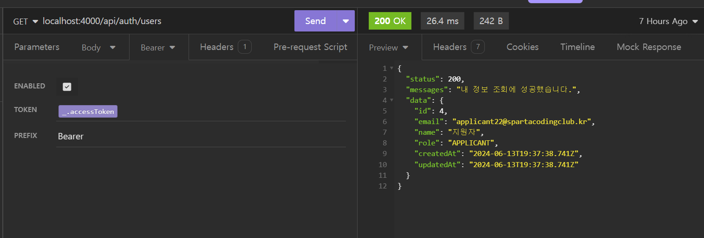

5. Access Token을 이용하여 이력서를 관리할 수 있다. (생성, 목록 조회, 상세 조회, 수정, 삭제 기능 구현 / 책임자 권한은 모든 유저의 이력서 조회 가능)

- 이력서 생성
  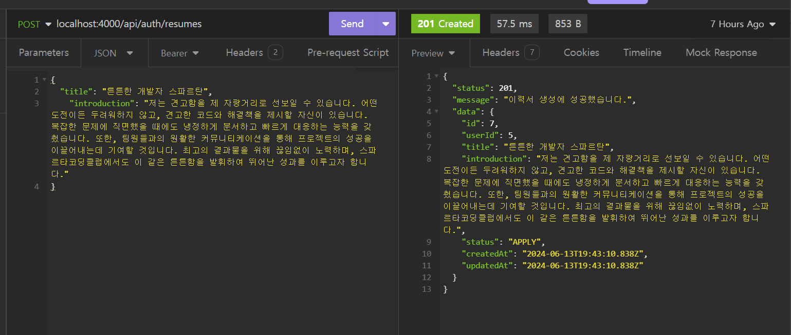
- 이력서 목록 조회

  (지원자 권한)
  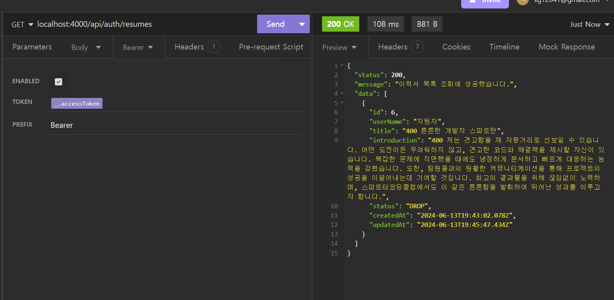

  (책임자 권한)
  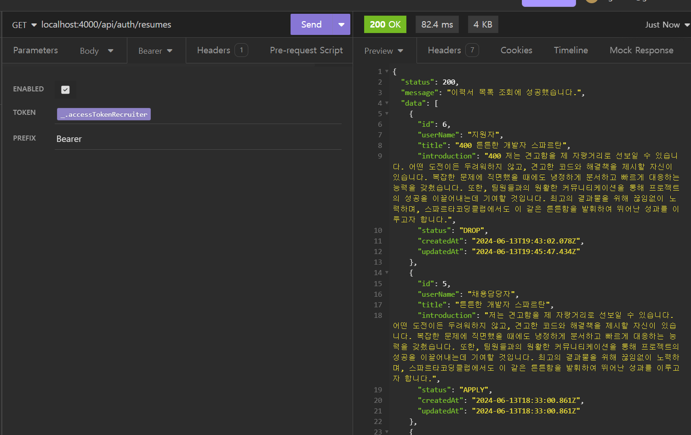

- 이력서 상세 조회
  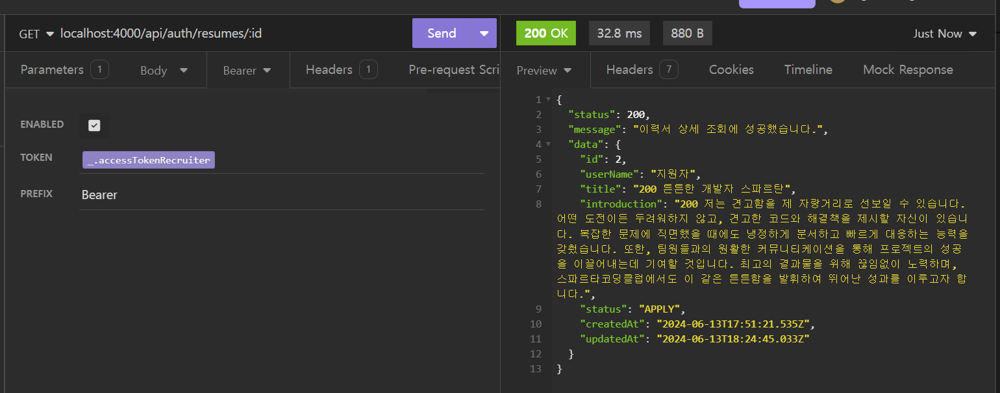

- 이력서 수정
  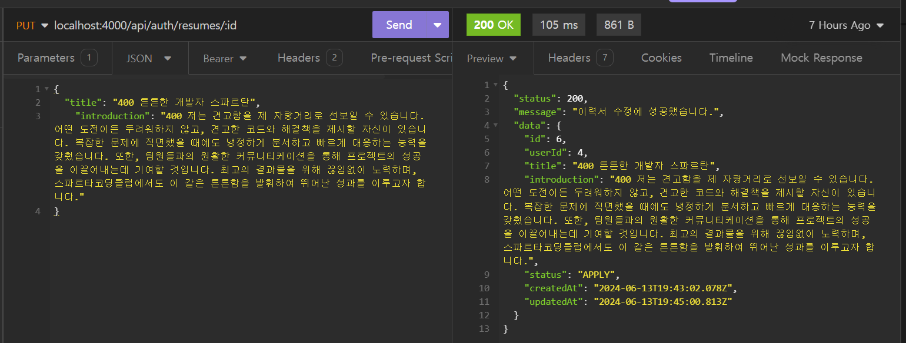

- 이력서 삭제
  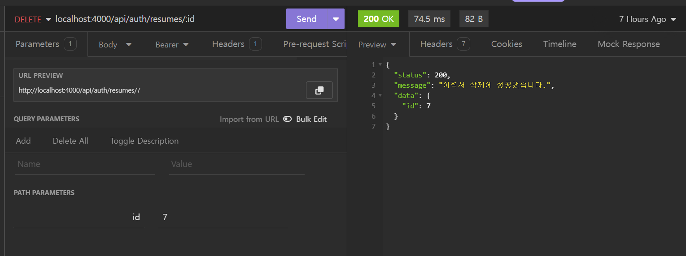

6. 이력서의 지원 상태를 변경하고, 로그 목록을 조회할 수 있다. (책임자 권한만 가능)

- 이력서 지원 상태 변경
  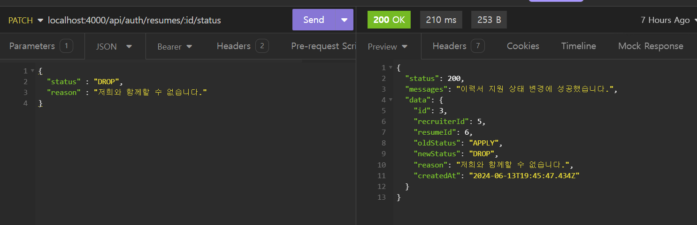

- 이력서 로그 목록 조회
  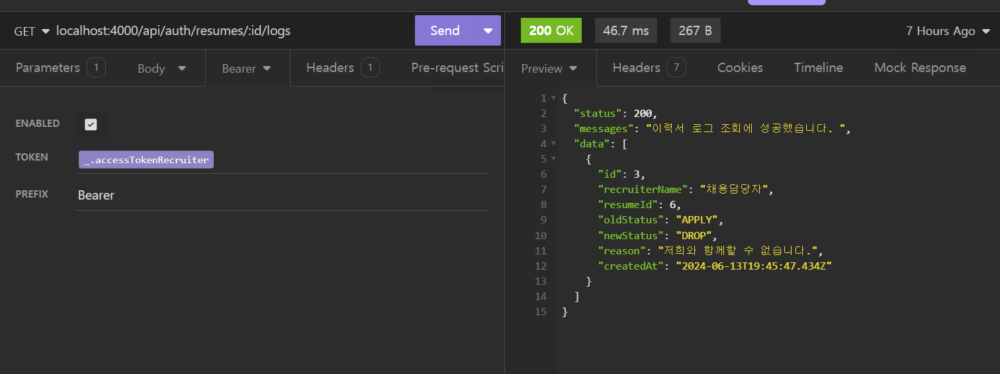

## 프로젝트 실행 방법

- 필요한 패키지 설치
  `yarn`

- 서버 실행(배포용)
  `yarn start`

- 서버 실행(개발용)
  `yarn dev`

- 서버 테스트
  `yarn test`


# API 명세서

https://www.notion.so/Node-js-API-e98b987233234ae8b05b09f3298fd12e

# ERD

https://drawsql.app/teams/soobeen/diagrams/-2

# 프로젝트 배포

https://www.soobeen.shop/api/auth/
